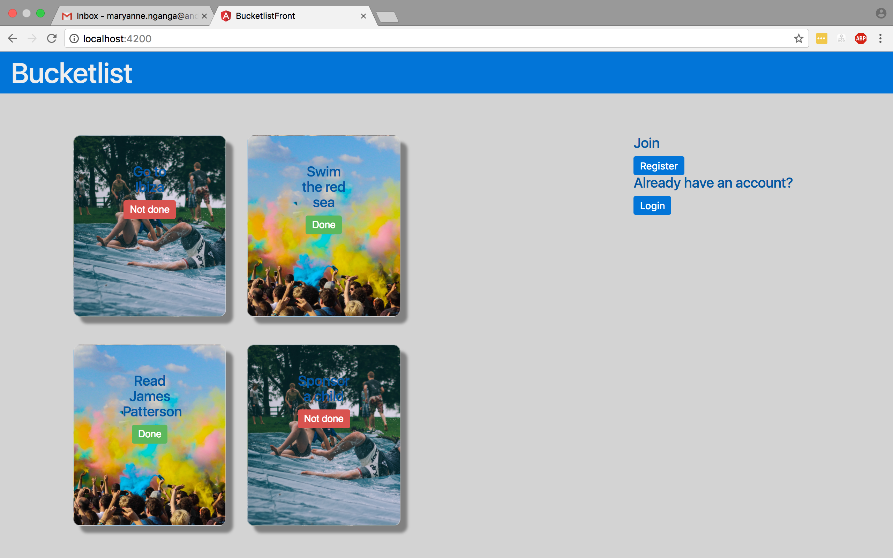
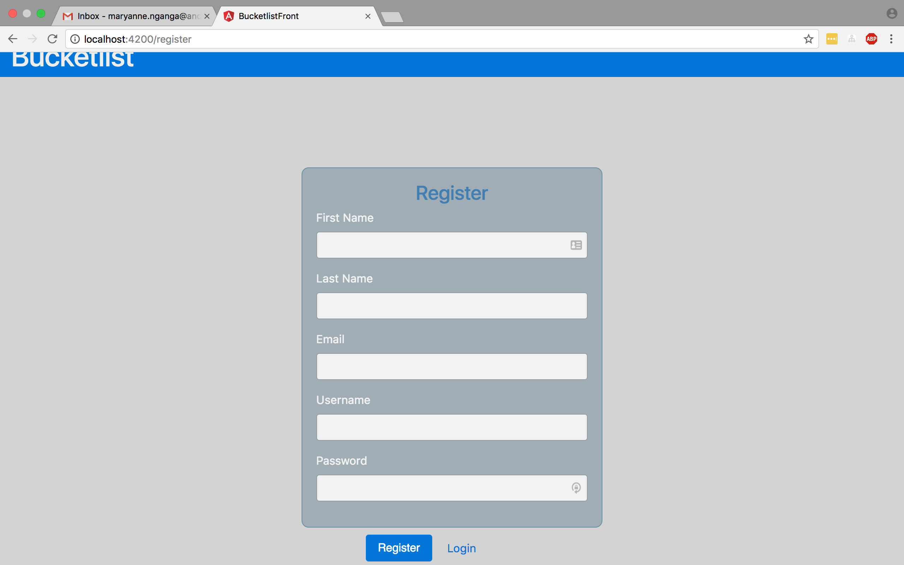
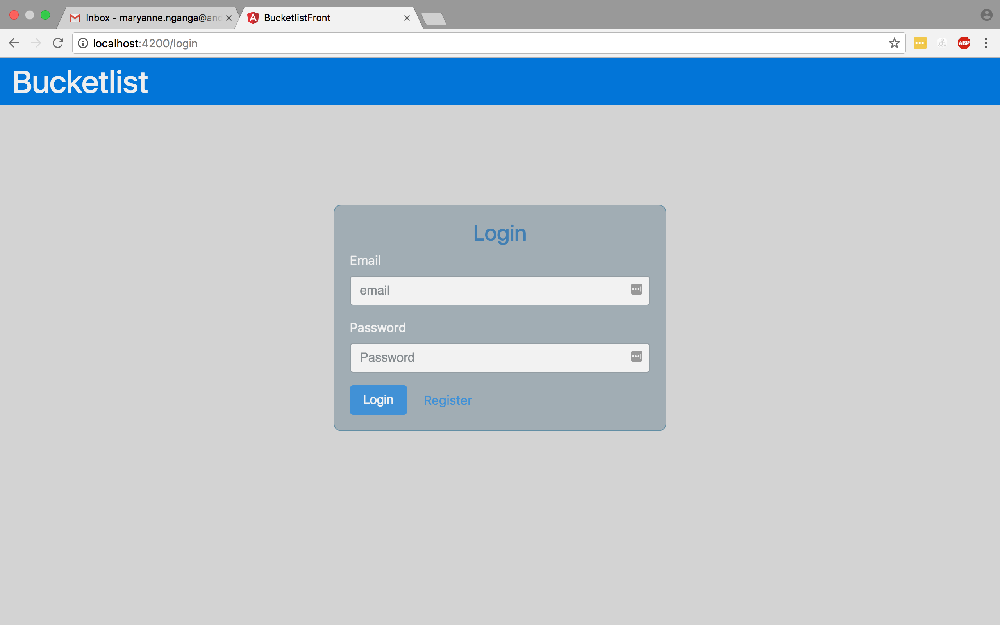
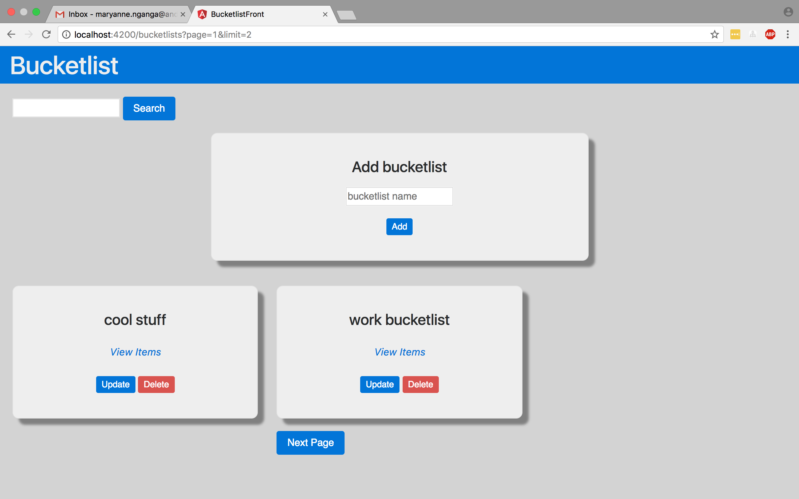
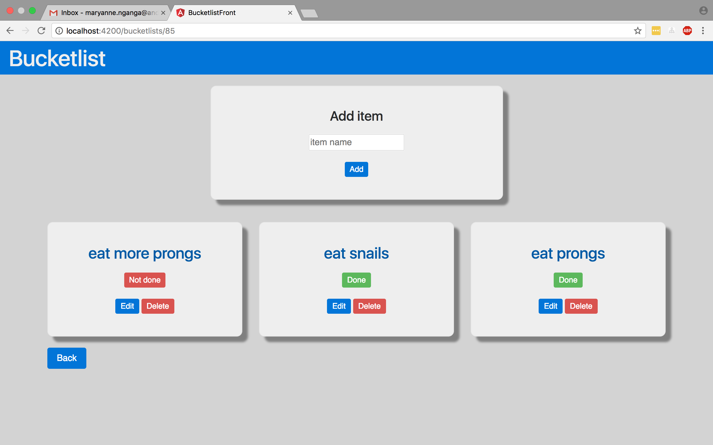

# The bucketlist
An that allows you to create, view and modify your bucketlists.

## Technologies
* Angular 2 Front end with HTML and CSS for design
* Flask - Python API for the backend link below.
    `https://github.com/NgangaMaryanne/Bucketlist/tree/develop`

## Installation
* Clone repository

    `git@github.com:NgangaMaryanne/BucketlistFront.git`

* Make virtual environment.

    `mkvirtualenv yourEnvName`

* Navigate to inner bucketlistFront directory

    `cd BucketlistFront`

* Install dependencies 

    `npm install`

    `npm install mdbootstrap --save`

* run project

    `npm start`

## The application
Below are screenshots documenting the flow of the application.
Welcome page:

 Register Page:

Login page:

bucketlist view page:

bucketlist items view page: 

